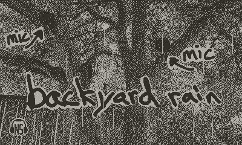
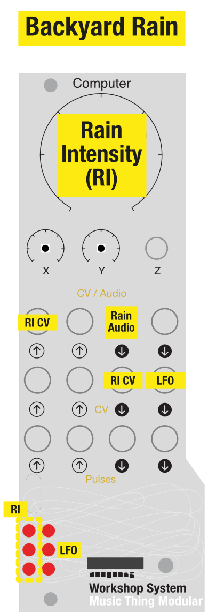

# Backyard Rain Soundscape



A port of the [Backyard Rain Soundscape](https://briandorsey.itch.io/backyard-rain-soundscape) Playdate app to the Music Thing Modular Workshop System Computer. 

Nature soundscape audio. A cozy rain ambience mix for background listening. You control the intensity. This card plays rain ambience which was recorded in my backyard. 

* Use the main knob to adjust rain intensity. (it cross fades between three recordings)
* Never hear the loops: detailed natural recordings of different lengths and slowly crossfaded playback mix. (LFO mixed with main knob.) 
* In synth terms, you could think of it as a noise oscillator sourced from nature. 

*"It's such a cozy little app."* -- my brother

## Downloads

* [Backyard Rain firmware for 2 MB cards](https://github.com/briandorsey/mtmws_cards/releases/download/v0.2.0/backyard_rain_2M_0_2_0.uf2.zip)
* [Backyard Rain firmware for 16 MB cards](https://github.com/briandorsey/mtmws_cards/releases/download/v0.2.0/backyard_rain_16M_0_2_0.uf2.zip)

## Installation

Download the firmware which matches the size card you have (most are 2 MB cards). Unzip the `uf2` file. Then follow the "How do I write a blank program card?" instructions from the [Computer and Program Card Guide](https://www.musicthing.co.uk/Computer_Program_Cards/). 

## Documentation



```text
This card crossfades between three loops of recorded rain. Heavy, medium, and
light rain. The current crossfade location is called "intensity", and intensity
is controlled with the Main knob. Where max is full heavy, center is full
medium, min is full light, and every point in between is a cross fade between
two recordings. For example, halfway between center and max would be a 50/50 mix
of medium and heavy rain.

Audio output 1: Backyard rain audio. Main knob position mapped to intensity.
Audio input  1: (if any) is mixed with Main knob position, Main knob acts as
                offset to incomming signal.

CV output 1   : Current intensity value as CV, about -6v to +6v
CV output 2   : Very slow triangle LFO, at ~25% amplitude, also mixed with
                intensity unless Audio input 1 is used.

Pulse output 1: Debugging output for now. Safe to ignore. Toggled at the
                beginning of every loop of sample_write_loop(). (so it should be
                1/2 of the sample rate (1/2 of 48k per second)
Pulse output 2: Debugging output for now. Safe to ignore. Set high during the
                working loop of sample_write_loop(), so duty cycle should be how
                much of the current cycle is used by the CPU.

LEDs: 1  2
      3  4
      5  6

1, 3, & 5     : Intensity & crossfade visualization. Top LED is heavy rain, then
                medium, and bottom is light rain. Dark = 0% mix. 
4             : Internal slow triangle LFO. Dark = -6v (moves very slowly)
```

## Recording info:

* LOM Uši omni microphones, separated by about 1.5m (5ft)
* Cinela Leonard wind protection
* Sony A10 recorder & a small Anker USB power supply
* recorded overnight June 2023, Seattle, WA, USA

## Customization

It's possible to create a customized edition of the card with recordings from your own backyard... or elsewhere :). See [CUSTOMIZING.md](CUSTOMIZING.md) for details. 
